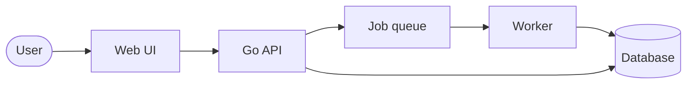
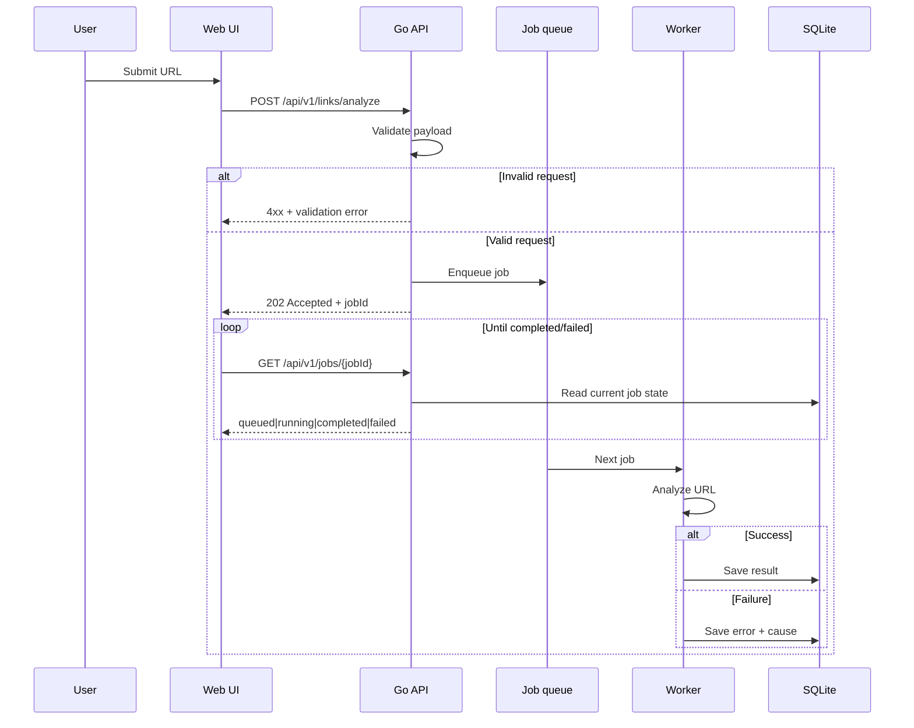

# Link Analyzer

Go service for analyzing URLs: the client submits a link, work runs in the background, state lives in DB, and the UI polls until the job finishes or fails.

## Stack

| Layer | Purpose/Notes |
|--------|--------|
| API | Go 1.26, `net/http`, `http.ServeMux` |
| UI | Static HTML/JS under `web/`, embedded into the binary; Bootstrap from jsDelivr |
| Persistence | SQLite — job status and analysis results |
| Work | Async job queue (in-process for this phase; can be swapped later) |

Local dev: `http://localhost:8080` (same origin for UI and API).

## Prerequisites

- Go 1.26.2 (Tested version)
- Docker — optional; image build in `build/package/Dockerfile`

## Run it

```bash
git clone https://github.com/praminda/link_analyzer.git
cd link_analyzer
```

Start server locally

```bash
go mod download
go run ./cmd
```

or using docker

```bash
docker build -f build/package/Dockerfile -t link-analyzer:latest .
docker run --rm -p 8080:8080 link-analyzer:latest
```

Then open `http://localhost:8080` (or the configured host/port using `HTTP_ADDR`).

### Environment (optional)

Configuration is read at startup from environment variables (`internal/appconfig`). Invalid combinations (for example `QUEUE_WORKER_COUNT` greater than `QUEUE_MAX_WORKERS`) cause the process to exit before listening.

| Variable | Default | Purpose |
|----------|---------|---------|
| `HTTP_ADDR` | `:8080` | TCP listen address for the HTTP server |
| `JOB_DB_PATH` | `data/jobs.sqlite` | SQLite path for job |
| `QUEUE_NAME` | `link-analyze` | Logical queue name for jobs |
| `QUEUE_MAX_RETRY_ATTEMPTS` | `1` | Job retries on failure |
| `QUEUE_MAX_WORKERS` | `4` | Max concurrent job workers |
| `QUEUE_CONCURRENCY_LIMIT` | `8` | Max active jobs |
| `QUEUE_WORKER_COUNT` | `2` | Worker goroutines started lazily after first enqueue; must be ≤ `QUEUE_MAX_WORKERS` |
| `ANALYZER_MAX_BODY_BYTES` | `2097152` (2 MiB) | Max HTML body read per analyzed URL |
| `ANALYZER_FETCH_TIMEOUT_SEC` | `30` | HTTP client timeout for the page fetch |
| `ANALYZER_MAX_REDIRECTS` | `5` | Max redirect hops when following `Location` (must be ≥ 1) |
| `ANALYZER_USER_AGENT` | (built-in browser-like string) | `User-Agent` header for the page GET |
| `LOG_LEVEL` | `info` | `debug`, `info`, `warn`, or `error` |
| `APP_ENV` | (unset) | Set to `production` for JSON logs on stdout |

Tests:

```bash
go test ./...
```

## What it does

1. User enters a URL in the browser.
2. `POST /api/v1/links/analyze` validates the body, enqueues a job, returns **`202 Accepted`** with a **`jobId`**.
3. Workers process jobs off the queue and persist progress and outcomes in SQLite.
4. The UI polls **`GET /api/v1/jobs/{jobId}`** until the job is done or failed.
5. On failure, the client gets the real error plus a **sanitized** explanation suitable for display.

**Logging:** Requests under `/api` are logged with method, path, status, duration, and an `X-Request-Id` for correlation.
**Safety:** URLs are validated (scheme, host, etc.) and resolved IPs are checked to reduce SSRF-style abuse (e.g. blocking private/loopback targets) before any fetch.

### Job queue: lazy worker startup

GoQueue workers are not started at process boot. They start on the first successful `POST /api/v1/links/analyze`, immediately before the job is enqueued. With the in-memory driver, the backing store only creates the named queue on the first `Dispatch`; if workers called `Pop` before any job existed, goqueue would log queue not found at startup.

## Architecture

### Components



### Request / job sequence



## API reference

OpenAPI are not published yet

## Challenges

- **Unsafe targets:** Mitigate SSRF by validating URLs and rejecting disallowed resolved addresses before fetching.
- **Simple ops story:** Serve the UI as embedded static files so one binary is enough for local and small deployments.

## Later

- Eager worker pool at boot — if goqueue’s in-memory driver ever initializes the queue bucket on first `Pop` (or equivalent), workers could be started in `main` again without startup log noise or tying worker lifecycle to the first HTTP enqueue.
- Graceful queue shutdown — call `Queue.Shutdown` on `SIGINT`/`SIGTERM` so in-flight jobs finish cleanly before exit.
- Auth and rate limits when the service is exposed for large public user base. Considered as out of spec for this phase
- CI: fmt, vet, tests, container build
- Metrics (e.g. Prometheus)
- Production ready database and/or external queue integration
- Frontend is embedded into the service in this implementation. We need to separate it out to a different delivery artifact for production. Currently implemented this way for simplicity.
- Make fetch client properties configurable. Env vars and a separate config file for the service.
