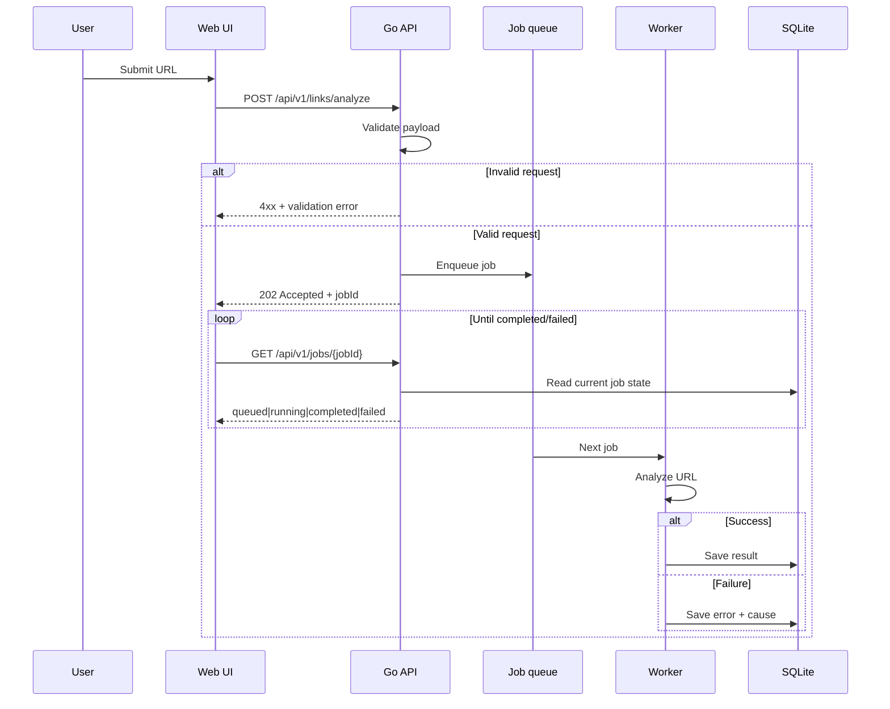

# Link Analyzer

Go service for analyzing URLs: the client submits a link, work runs in the background, state lives in DB, and the UI polls until the job finishes or fails.

## Stack

| Layer | Purpose/Notes |
|--------|--------|
| API | Go 1.26, `net/http`, `http.ServeMux` |
| UI | Static HTML/JS under `web/`, embedded into the binary; Bootstrap from jsDelivr |
| Persistence | SQLite — job status and analysis results |
| Work | Async job queue (in-process for this phase; can be swapped later) |

Local dev: `http://localhost:8080` (same origin for UI and API).

## Prerequisites

- Go 1.26.2 (Tested version)
- Docker — optional; image build in `build/package/Dockerfile`

## Run it

```bash
git clone https://github.com/praminda/link_analyzer.git
cd link_analyzer
go mod download
go run ./cmd
```

Then open `http://localhost:8080`. The process listens on port **8080**.

Environment (optional):

- `APP_ENV=production` — JSON logs to stdout
- `LOG_LEVEL` — `debug`, `info`, `warn`, or `error`

Tests:

```bash
go test ./...
```

## What it does

1. User enters a URL in the browser.
2. `POST /api/v1/links/analyze` validates the body, enqueues a job, returns **`202 Accepted`** with a **`jobId`**.
3. Workers process jobs off the queue and persist progress and outcomes in SQLite.
4. The UI polls **`GET /api/v1/jobs/{jobId}`** until the job is done or failed.
5. On failure, the client gets the real error plus a **sanitized** explanation suitable for display.

**Logging:** Requests under `/api` are logged with method, path, status, duration, and an `X-Request-Id` for correlation.
**Safety:** URLs are validated (scheme, host, etc.) and resolved IPs are checked to reduce SSRF-style abuse (e.g. blocking private/loopback targets) before any fetch.

## Architecture

### Components


### Request / job sequence



## API reference

OpenAPI are not published yet

## Challenges so far

- **Unsafe targets:** Mitigate SSRF by validating URLs and rejecting disallowed resolved addresses before fetching.
- **Simple ops story:** Serve the UI as embedded static files so one binary is enough for local and small deployments.

## Later

- Auth and rate limits when the service is exposed for large public user base
- CI: fmt, vet, tests, container build
- Metrics (e.g. Prometheus)
- Heavier database and/or external queue when SQLite and in-process workers stop being enough
- Frontend is embedded into the service in this implementation. We need to separate it out to a different delivery artifact for production. Currently implemented this way for simplicity.
